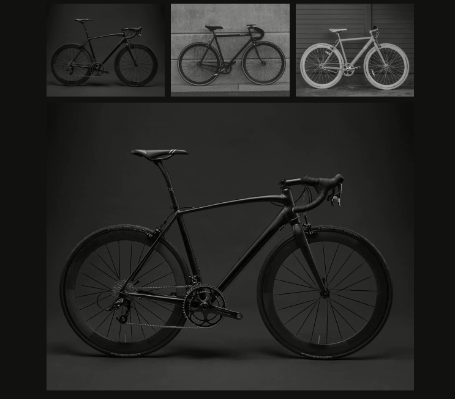

<div align="center" id="top"> 
  

&#xa0;

  <h1>Galeria Simples</h1>
</div>

<h1 align="center">Solucionar Problemas</h1>

<p align="center">
  

  

  

    
</p>

<p align="center">
  <a href="#dart-about">About</a> &#xa0; | &#xa0; 
  <a href="#sparkles-features">Features</a> &#xa0; | &#xa0;
  <a href="#rocket-technologies">Technologies</a> &#xa0; | &#xa0;
  <a href="#white_check_mark-requirements">Requirements</a> &#xa0; | &#xa0;
  <a href="#checkered_flag-starting">Starting</a> &#xa0; | &#xa0;
  <a href="#memo-license">License</a> &#xa0; | &#xa0;
  <a href="https://github.com/wsasouza" target="_blank">Author</a>
</p>

<br>

## :dart: About

#### Solucionar Problemas do DOM

4 perguntas básicas que você tem que responder para que o seu projeto funcione:

- Quais elementos serão observados ou modificados no DOM?
- Quais eventos serão observados? É um evento de click? Ou um evento de scroll?
- Quais informações dos elementos/browser precisamos?
- Quais informações dos elementos/browser serão alteradas?

#### Galeria

1. Lista de imagens (li img) e a imagem principal.
   1.1 Como selecionar uma lista de itens?
   1.2 Como selecionar um item?

2. Clique em um dos itens da lista.
   2.1 Como adicionar um event de click a uma lista de itens?

3. Precisamos da URL do item clicado.
   3.1 Como obter a URL de um elemento?

4. Precisamos alterar a URL da imagem principal.
   4.1 Como alterar a URL de um elemento?

## :sparkles: Features

:heavy_check_mark: Feature 1;\
:heavy_check_mark: Feature 2;\
:heavy_check_mark: Feature 3;

## :rocket: Technologies

The following tools were used in this project:

- [HTML 5](https://developer.mozilla.org/en-US/docs/Web/HTML)
- [CSS 3](https://developer.mozilla.org/en-US/docs/Web/CSS)
- [Javascript](https://developer.mozilla.org/en-US/docs/Learn/JavaScript)

## :white_check_mark: Requirements

Before starting :checkered_flag:, you need to have [Git](https://git-scm.com) and [Node](https://nodejs.org/en/) installed.

## :checkered_flag: Starting

```bash
# Clone this project
$ git clone https://github.com/wsasouza/galeria-simples.git

# Access
$ cd galeria-simples

# Access the index.html file
$ Open with Live Server

```

## :memo: License

This project is under license from MIT. For more details, see the [LICENSE](LICENSE.md) file.

Made with :heart: by <a href="https://github.com/wsasouza" target="_blank">Walter Santos de Andrade Souza</a>

&#xa0;

<a href="#top">Back to top</a>
